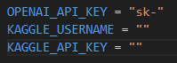
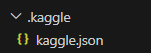
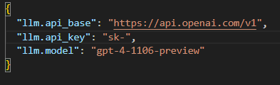

# WeaverOfTasks

## Table of Contents:
- 1 [Installation](https://github.com/alckasoc/WeaverOfTasks/blob/main/README.md#installation)
    - 1.1 [Setting Up Environment Variables](https://github.com/alckasoc/WeaverOfTasks/blob/main/README.md#settingupenvironmentvariables)
    - 1.2 [Setting Up TaskWeaver](https://github.com/alckasoc/WeaverOfTasks/blob/main/README.md#settinguptaskweaver)
    - 1.3 [Setting Up Other Requirements](https://github.com/alckasoc/WeaverOfTasks/blob/main/README.md#settingupotherrequirements)

## Installation

1. First, clone the repository.

```
git clone https://github.com/alckasoc/WeaverOfTasks
```

### Setting Up Environment Variables

2. Create a `.env` file in the root directory. Within this `.env` file, define your `OPENAI_API_KEY`, `KAGGLE_USERNAME`, and `KAGGLE_API_KEY`.



3. Within your root directory, create a folder called `.kaggle` and create a json file `kaggle.json` within that folder.



4. Populate the `kaggle.json` like below. Make sure to fill in "username" with your `KAGGLE_USERNAME` and "key" with your `KAGGLE_API_KEY`.

```json
{
    "username": "",
    "key": ""
}
```

### Setting Up TaskWeaver

5. Create a `conda` environment following TaskWeaver's environment creation instructions. 

```
conda create -n taskweaver python=3.10
conda activate taskweaver
```

6. Install all TaskWeaver requirements first.

```
cd TaskWeaver
pip install -r requirements.txt
cd ..
```

7. Update the OpenAI `api_key` within `TaskWeaver/project/taskweaver_config.json`. This is the same as `OPENAI_API_KEY`.




### Setting Up Other Requirements

8. Next, install all requirements relevant to this repository.

```
pip install -r requirements.txt
```
